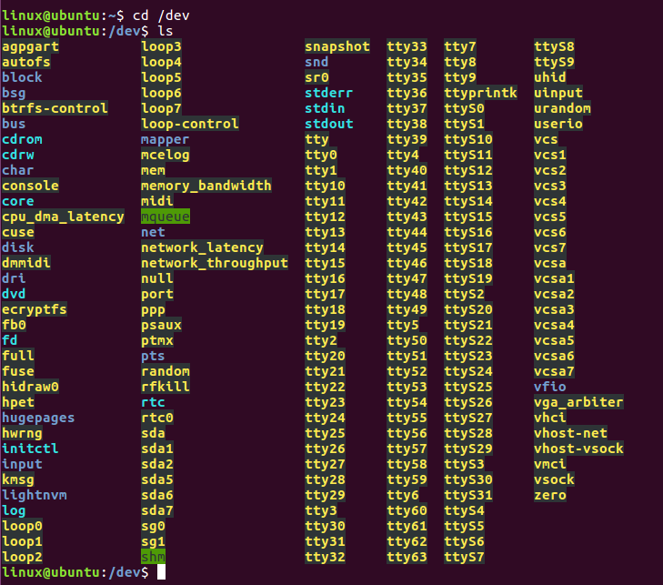
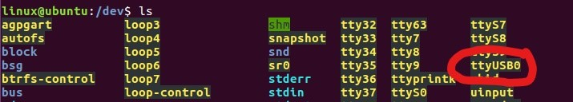
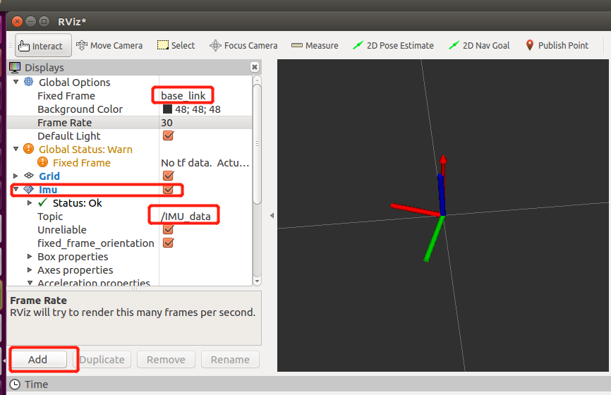

# hao_sensor_launch
放一些传感器ROS启动

## 01 fdilink_ahrs
GNSS+IMU G90


## 02 ROS串口例程

本文档介绍如何在ROS下来读取HI226/HI229的数据，并提供了c++语言例程代码，通过执行ROS命令，运行相应的节点，就可以看到打印到终端上的信息。

* 测试环境：Ubuntu16.04   

* ROS版本：ROS Kinetic Kame

* 测试设备：HI226 HI229

### 1. 安装USB-UART驱动

Ubuntu 系统自带CP210x的驱动，默认不需要安装串口驱动。将调试版连接到电脑上时，会自动识别设备。识别成功后，会在dev目录下出现一个对应的设备:ttyUSBx

检查USB-UART设备是否被Ubantu识别：

1. 打开命令行(ctrl + alt + t)
2. 输入 ls /dev 查看是挂载成功USB转串口设备
3. 查看是否存在  ttyUSBx 这个设备文件。x表示USB设备号，由于Ubuntu USB设备号为从零开始依次累加，所以多个设备每次开机后设备号是不固定的，需要确定设备的设备号。下图为没有插入HI226/HI229评估板时的dev设备列表，这个时候，dev目录下并没有名为 __ttyUSB__ 文件



4. 插入USB线，连接调试板，然后再次执行ls  /dev。 dev目录下多了一个设备, 如图：



**ttyUSB0** 文件就是调试版在ubuntu系统中生成的设备(后面的数字是不固定的，有可能为 ttyUSB1  或 ttyUSB2)

5. 打开USB设备的可执行权限：
```shell
   $ sudo chmod 777 /dev/ttyUSB0
```
### 2. 安装ROS serial软件包

本例程依赖ROS提供的serial包实现串口通信.

1. 首先执行如下命令，下载安装serial软件包：

```shell
$ sudo apt-get install ros-kinetic-serial
```

2. 然后输入`roscd serial`命令，进入serial下载位置，如果安装成功，就会出现如下信息：

```shell
$:/opt/ros/kinetic/share/serial
```

### 3. 编译serial_imu_ws工作空间

1. 打开终端进入/examples/ROS/serial_imu_ws 目录

2. 执行catkin_make命令，编译成功后出现完成度100%的信息。

### 4. 修改串口波特率和设备号

1. 在Ubuntu环境中，支持的波特率为115200, 460800, 921600。本例程使用的默认波特率是115200，默认打开的串口名称是/dev/ttyUSB0。	

2. 如果您需要更高的输出频率，请编辑serial_imu.cpp文件，修改serial_imu.cpp文件中的宏定义，改为其他波特率。	
```c
#define IMU_SERIAL "/dev/ttyUSB0"
#define BAUD 115200
```

注意修改后需要回到serial_imu_ws目录下，重新执行catkin_make命令

### 5. 显示数据
本例程提供了三种查看数据方式：

1. 第一种方式是显示所有的数据信息，通过printf把imu上传的所有的信息都打印到终端上，便于查看数据。
2. 打印ROS标准imu_msg 数据
3. rviz工具实现可视化

#### 	5.1：输出IMU原始数据

1. 打开另一个终端，执行`roscore`开启ROS
```shell
$ roscore
```
2. 回到serial_imu_ws文件夹下 执行 

```shell
$ source devel/setup.bash
```

2. 执行启动rosrun 启动接受程序

```shell
$ rosrun serial_imu serial_imu
```

执行成功后，就可以看到所有的信息：

```txt

     Devie ID:     0
    Run times: 0 days  3:26:10:468
  Frame Rate:   100Hz
       Acc(G):   0.933    0.317    0.248
   Gyr(deg/s):   -0.02     0.30    -0.00
      Mag(uT):    0.00     0.00     0.00
   Eul(R P Y):   52.01   -66.63   -60.77
Quat(W X Y Z):   0.770    0.066   -0.611   -0.172
Pleaes enter ctrl + 'c' to quit....

```

#### 	5.2：输出ROS标准 Imu.msg

1. 在windows系统下进行配置模块，使能四元数输出。
2. 使用Window下 Uranus上位机进行配置：先把模块连接到PC机上。然后使用Uranus工具进行 连接对应的com口，点击 __工具__  --->  __配置模块__，在协议配置区域，可以选择老协议中单独勾选 __加速度__ 、__角速度__ 、 __四元数__ ，或者是选择新协议的 __IMU数据集合__ 。勾选好之后，点击 __写入配置__ ，接收区最后显示 __ok__ ，说明配置成功。在关闭配置窗口上，看一下数据显示区域，最后确认一下，加速度、角速度、四元数是否正确输出。执行`roslaunch imu_launch imu_msg.launch`命令。执行成功后，就可以看到ROS定义的IMU话题消息：
```txt
header: 
  seq: 595
  stamp: 
    secs: 1595829903
    nsecs: 680423746
  frame_id: "base_link"
orientation: 
  x: 0.0663746222854
  y: -0.611194491386
  z: -0.17232863605
  w: 0.769635260105
orientation_covariance: [0.0, 0.0, 0.0, 0.0, 0.0, 0.0, 0.0, 0.0, 0.0]
angular_velocity: 
  x: 0.0851199477911
  y: 0.0470183677971
  z: 0.00235567195341
angular_velocity_covariance: [0.0, 0.0, 0.0, 0.0, 0.0, 0.0, 0.0, 0.0, 0.0]
linear_acceleration: 
  x: 0.93323135376
  y: 0.317857563496
  z: 0.247811317444
linear_acceleration_covariance: [0.0, 0.0, 0.0, 0.0, 0.0, 0.0, 0.0, 0.0, 0.0]

```

#### 	5.3：rviz可视化

1. 安装ROS rviz插件
2. 同上节，使能模块四元数输出
3. 进入serial_imu_ws，执行`roslaunch imu_launch imu_rviz.launch`命令，执行成功后，rviz工具被打开。
4. 先点击左下角的Add标签，然后在弹出窗口中，选择 By display type标签，查找rviz_imu_plugin；找到之后，选择它下面的imu标签，点击OK, 这时，我们可以看到rviz的左侧的展示窗口中已经成功添加上了Imu的标签。在FixedFrame中填入**base_link** 。topic中添加 **/IMU_data**。这时，可以看到坐标系随传感器改变而改变。
5. ​	可以从这里下载rviz的工具：

```shell
git clone -b indigo https://github.com/ccny-ros-pkg/imu_tools.git
```


## 6. FAQ
1. 如果在执行`rosrun serial_imu serial_imu`时候，出现如下错误：


这是由于没有配置环境的原因导致的，解决办法就是在当前终端执行`source ~/serial_imu_ws/devel/setup.bash`命令。但是这个办法并不能一次性解决，每次开启一个终端，运行新节点都需要为该终端设置环境变量。所以按照如下方式，可以不用这么麻烦： 执行`gedit ~/.bashrc`命令，打开一个文件，然后在这个文件的末尾加入ROS程序注册命令。(serial_imu_ws_dir为serial_imu_ws所在目录)

```shell
$ source <serial_imu_ws_dir>/devel/setup.bash
```

2. 串口打开失败，权限不够。执行chmod命令，开启权限。

```shell
$ sudo chmod 777 /dev/ttyUSB0
```